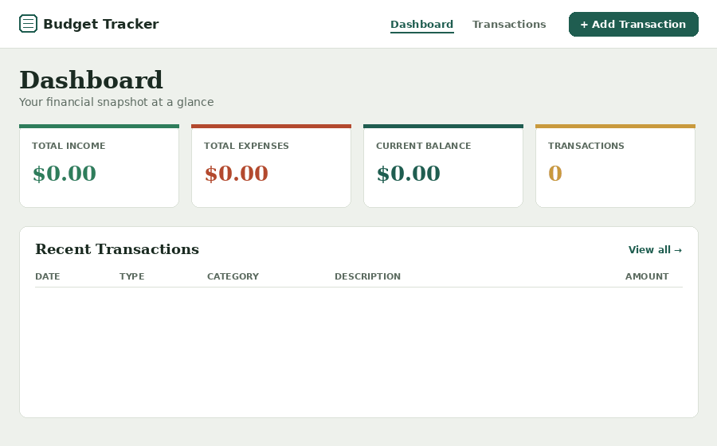

<div align="center">

# Budget Tracker

**A little ledger app that lives in the cloud — literally. Your data sits in a Google Sheet you already own.**


<br/>



<sub><em> A preview mockup of the actual UI/design system — swap in your own screen recording once you're running it locally (see <a href="#-quick-start">Quick Start</a>).</em></sub>

</div>

---

##  Overview

Most "budget tracker" tutorials give you a to-do list with a dollar sign on it. This one
tries to feel like an actual ledger: a serif headline, tabular numbers that line up in
columns, and index-card-style stat tiles with a coloured edge that tells you what
they mean before you even read the label.

Under the hood it's a proper three-tier app — **Angular talks only to Spring Boot,
Spring Boot talks only to Google Sheets.** No database server to provision, no ORM to
configure — just a spreadsheet, a service account, and a clean REST API in between.

##  Features

-  **Add, edit, delete** income & expense transactions
-  **Filter** by type, category, and date range — on the list *and* the dashboard summary
-  **Live dashboard**: total income, total expenses, current balance, transaction count
-  **Validation on both ends** — reactive forms up front, Bean Validation on the API
-  **Google Sheets as the database** — open the sheet any time and see your data, raw
-  **Clean layered architecture** — controller → service → repository on the backend,
  core/shared/features/models/services on the frontend
-  **Toast notifications** for every success/error, driven by a single HTTP interceptor
-  **Responsive** — works from a phone as comfortably as a desktop

##  Built with

| Layer | Technology |
|---|---|
| **Frontend** | Angular 18 (standalone components) · TypeScript · Reactive Forms · Angular Router · HttpClient |
| **Backend** | Spring Boot 3 · Java 17 · Bean Validation · Maven |
| **Database** | Google Sheets, via the Google Sheets API v4 + a service account |
| **Styling** | Hand-written SCSS design system — no UI framework, no Tailwind |

##  How it fits together

```
┌─────────────────────┐        HTTP / JSON        ┌──────────────────────┐        Sheets API        ┌───────────────────┐
│   Angular frontend   │  ───────────────────────▶ │   Spring Boot API     │  ───────────────────────▶ │   Google Sheet     │
│   localhost:4200      │ ◀─────────────────────── │   localhost:8080      │ ◀───────────────────────  │   "Transactions" tab│
└─────────────────────┘                            └──────────────────────┘                            └───────────────────┘
```

The frontend **never** sees a Google credential — it only ever calls `/api/**`. The
backend is the sole owner of the service account key and all spreadsheet I/O.

---

## 📖 Full documentation

<details>
<summary><strong> Google Cloud & Google Sheets setup</strong></summary>
<br>

The backend authenticates as a **service account** — the standard way for a server
(as opposed to a signed-in person) to call Google APIs unattended.

1. **Create/select a Google Cloud project** at [console.cloud.google.com](https://console.cloud.google.com/).
2. **Enable the Google Sheets API** — *APIs & Services → Library* → search "Google Sheets API" → **Enable**.
3. **Create a service account** — *APIs & Services → Credentials → Create Credentials → Service account*. No IAM role needed; access is controlled by sharing the sheet (step 6).
4. **Create a JSON key** — open the service account → *Keys* tab → *Add Key → Create new key → JSON*. Keep this file private; never commit it.
5. **Create the sheet** — a new spreadsheet, first tab named `Transactions` (or set `GOOGLE_SHEETS_SHEET_NAME` to match). The header row is created automatically on first run.
6. **Share the sheet** with the service account's `client_email` (found in the JSON key) as **Editor**.
7. **Copy the spreadsheet ID** from the URL: `.../spreadsheets/d/`**`THIS_PART`**`/edit`.

</details>


<details>
<summary><strong> Known trade-offs</strong></summary>
<br>

Google Sheets is a lightweight, zero-infrastructure database, which comes with real
limits: writes resolve a row number by scanning first (not built for heavy
concurrency), reads pull the full range and filter in-memory (fine for personal use,
not tens of thousands of rows), and the Sheets API has its own quotas.

The layered architecture keeps the door open, though — swap
`GoogleSheetsTransactionRepository` for a JPA-backed implementation of the same
`TransactionRepository` interface, and nothing in the service, controller, or
frontend layers needs to change.

</details>

---

## Ideas for going further

-  Charts on the dashboard (spend by category, income vs. expense over time)
-  Recurring transactions
-  CSV export
-  Multi-currency support
-  Real user accounts (right now it's single-sheet, single-user by design)

##  Contributing

Issues and PRs are welcome. If you're proposing something bigger than a bug fix,
open an issue first so we can talk through the approach.


---

<div align="center">
<sub>Built with Angular, Spring Boot, and a Google Sheet doing its best impression of a database.</sub>
</div>
